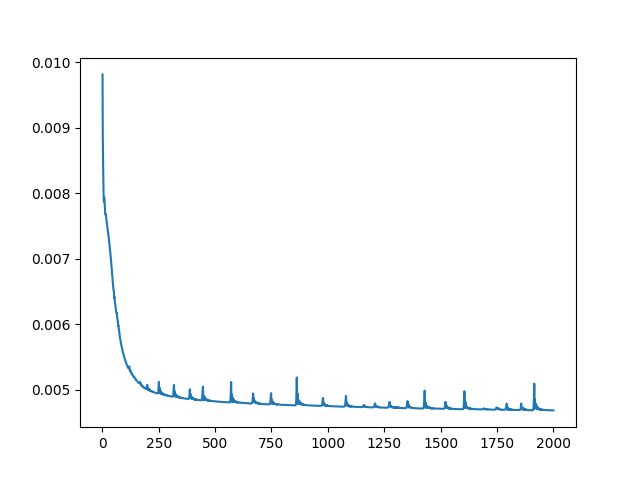
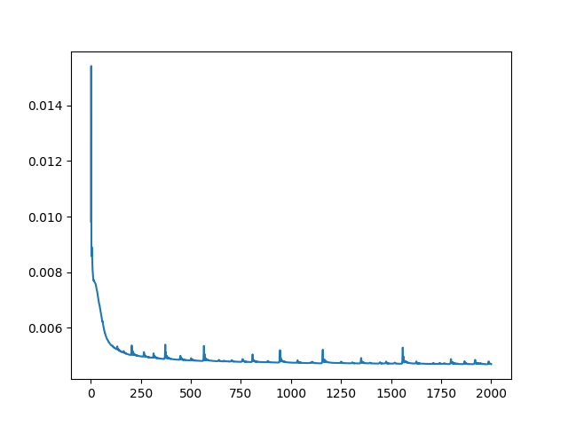

### 尝试对Zero-Shot-Noise2Noise进行复现

根据CVPR2023论文Zero-Shot-Noise2Noise复现了一个去噪模型,[原论文地址](https://arxiv.org/abs/2303.11253)

#### 结果

**原图和加噪后的图像**对比

加噪后图像的**下取样对**:

使用0.001和0.002的学习率分别训练2000轮, 损失函数随训练轮数的变化曲线如下:

最终去噪后的结果对比:

